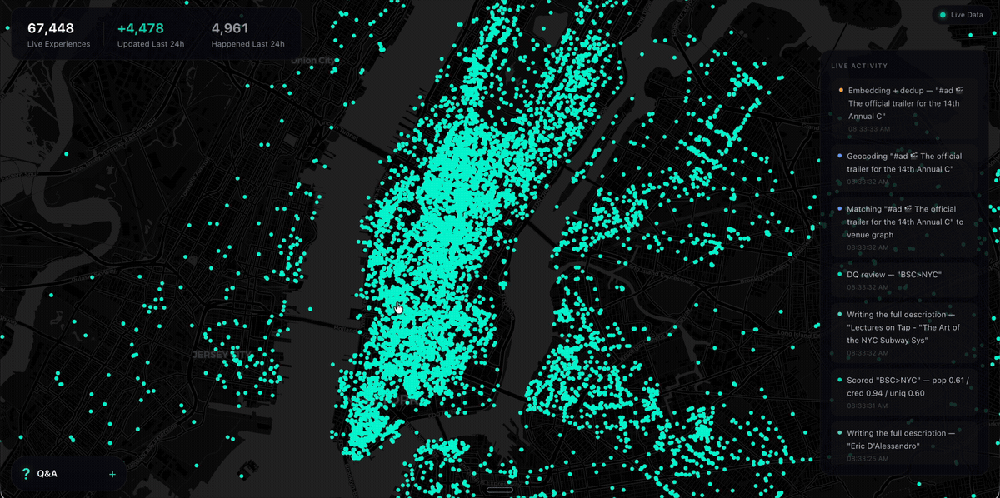

# SyncSo

**Let your agents understand what's happening locally, in real time.**

[](https://rtdb.syncso.com/database)

Ask a model what to do in New York and it names the Whitney. It is not wrong.
It is just answering from a guidebook, because that is what it has — a city as
a list of places, frozen whenever the training run ended.

What it does not have is everything going on inside those places, and the
thousand rooms that never make a guidebook. The Tuesday gig. The pottery class
with two seats left. The night market under the bridge. Your model has never
heard of any of it.

SyncSo is that missing half: live music, theater, comedy, film, art, sports,
festivals, markets, food and drink, classes, tours, nightlife — the whole
surface of a city, each thing carrying its dates, times, prices, booking links
and images. Not one category. Not the famous parts.

Which means your agent can finally take the questions it used to hand back.
Where to take a visiting parent on a Tuesday. What a couple could book three
weeks out. What is free, outdoors, and happening in the next four hours.
Real answers, with a link to book them.

## Install

One catalogue, two doors. Assistants that speak MCP connect to
`https://rtdb.syncso.com/partner/mcp`. Anything else reads the skill file at
`https://syncso.com/SKILL.md`. Both open the same account: the first search
asks the person to sign in once at syncso.com, and every account starts with
a free monthly allowance of searches.

### Claude

In Claude.ai or the Claude desktop app: **Settings → Connectors → Add custom
connector**, paste the MCP URL, and ask. Claude also lists SyncSo in its
directory, where it is one click.

In Claude Code, connect the MCP server:

```bash
claude mcp add --transport http syncso https://rtdb.syncso.com/partner/mcp
```

or install the skill as a plugin, which keeps itself current:

```bash
claude plugin marketplace add SyncSo-Inc/syncso
claude plugin install syncso@syncso
```

### ChatGPT

Coming to the ChatGPT app directory. Until it is listed: **Settings → Apps &
Connectors → Advanced → Developer mode**, add a connector, paste the MCP URL.
Developer mode is not available on every plan.

### Cursor, Windsurf, VS Code and other MCP clients

Add SyncSo to the client's MCP configuration:

```json
{
  "mcpServers": {
    "syncso": { "url": "https://rtdb.syncso.com/partner/mcp" }
  }
}
```

### OpenClaw

```bash
openclaw skills install @liangstl/syncso
```

Also on [ClawHub](https://clawhub.ai/LiangSTL/skills/syncso), where
`clawhub install syncso` does the same.

### Coding agents that read skill folders

Claude Code, Codex, Cursor, Copilot and the rest, one command:

```bash
npx skills add SyncSo-Inc/syncso
```

### Anything else

Tell your assistant:

```
Set up SyncSo from https://syncso.com/SKILL.md
```

The file carries the guidance and the tool definitions, works with anything
that can call a tool and make an HTTPS request, and the copy at that URL is
always the current one. A person using it gets their sign-in code at
[syncso.com/connect](https://syncso.com/connect).

Two tools do the work, `find_things_to_do` and `get_details`. That is the
whole surface.

## Coverage

New York only, for now. More cities over the coming months.

Within it, everything: every category above, from the institutions down to the
one-night thing in a room above a bar. Ask about anywhere else and the skill
tells your model to say so rather than invent an answer — the same refusal to
guess that makes the New York answers worth trusting.

## Links

- [syncso.com](https://syncso.com) — what SyncSo is
- [syncso.com/connect](https://syncso.com/connect) — where your user gets their code
- [syncso.com/SKILL.md](https://syncso.com/SKILL.md) — the skill itself, always the current copy ([also in this repo](syncso/SKILL.md))

## Questions

Something missing, wrong, or not working the way this page says? Open an
[issue](https://github.com/SyncSo-Inc/syncso/issues), or email
[hello@syncso.com](mailto:hello@syncso.com). And if there is a city you want
open, tell us.

## License

MIT. See [LICENSE](LICENSE).
